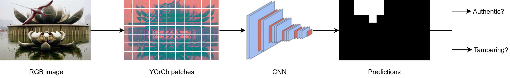

# Solution

This solution helps to identify documents that have been modified. Documents such as an Income Statement or pictures are run through a ML algorithm that can provide a risk score on the authenticity of each document. It employs a deep neural network that looks at the relationship of each pixel on the document and calculates if any modifications were made.

Eg. If a person gets into a car accident and exaggerates his car’s damage by editing the picture of his car to claim more insurance than needed, the model would be able to pick it up to declare its false authenticity.
This solution can be applied in the insurance industry or public sector to increase the efficiency and accuracy of processing workloads in high volumes.

# Image-Forgery-using-Deep-Learning
Image Forgery Detection using Deep Learning, implemented in PyTorch.

## Proposal
The whole framework: An RGB image, firstly, is divided into overlapping patches (64x64). Then, RGB patches are converted to the YCrCb color channel, before being scored by a network. Lastly, a post-processing stage is designed to refine predictions of the network and make a final conclusion on the authentication of the image.

  

The deep neural network is adapted from MobileNet-V2. However, we modify the original MobileNet-V2 to be more relevant to our problem. The picture below depicts the architecture modification.

  

## Experimental results
We have conducted a comprehensive evaluation on model configurations to show which factor improves the final
performance of the model. To figure out this, we define six configurations accompanied with the MobileNetV2, denoted
as MBN2, as the core. There are two color channels to be considered, namely RGB and YCrCb. Besides, three MobileNetV2 architectures are taken into account for comparing. The first architecture is MobileNetV2 trained from scratch, the second one is MobileNetV2 initialized with pre-trained weights from ImageNet, and the last one is modified MobileNetV2 trained from scratch.

  
  

